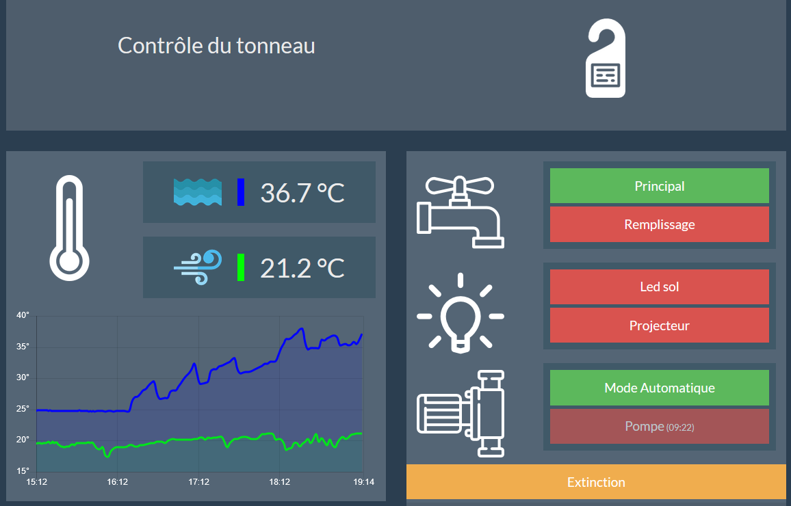

# Jacuzzi

Monitoring and remote control of jacuzzi.

## Client HTML/JS
* Client-server conncetion with [Woopsa](https://github.com/woopsa-protocol/Woopsa).
* JQuery
* Chart.js

## Server C#/.NET
* Connected with Modbus